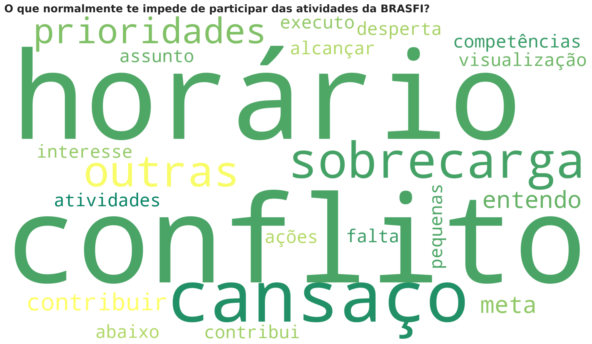

# 📊 BRASFI Survey Analysis — Interim Results

This repository analyzes survey data from **BRASFI — Trilha COP30 Palestras**.  
The workflow is written in **Python**, executed in **RStudio Cloud (via reticulate)**.

---

## ⚙️ Requirements

- Python packages: `pandas`, `matplotlib`, `seaborn`, `wordcloud`, `openpyxl`  
- Environment: RStudio Cloud with **reticulate**

```python
import pandas as pd
import matplotlib.pyplot as plt
import seaborn as sns
from wordcloud import WordCloud, STOPWORDS
```

---

## 🔍 Data Cleaning & Normalization

- Column names standardized (spaces trimmed).  
- Patch applied: responses about **alignment of expectations** recoded into `"Sim"` and `"Não"` for consistency.  

```python
# Example: recoding alignment question
df.loc[mask_nao_1 | mask_nao_2, alin_col] = "Não"
df.loc[mask_sim_plain | mask_sim_justa, alin_col] = "Sim"
```

---

## 📈 Quantitative Visualizations

- **Pie charts** for categorical questions (aggregating small groups as *Outros*).  
- **Horizontal bar charts** when categories are long or numerous.  

```python
# Example: horizontal bar chart
sns.barplot(x=counts.values, y=counts.index, color="#568203")
plt.xlabel("Frequência")
plt.ylabel("Categoria")
plt.title("Participação em setores da BRASFI")
```

**Interim Results (examples):**
- Participation in **sectors/núcleos**: majority answered *Sim*.  
- Preferred **frequency of meetings**: most chose *Quinzenal*.  
- Accessibility of **schedule (quartas, 19h)**: mixed responses, with many requesting alternatives.  

📊 Example output:  


---

## ☁️ Word Clouds for Open Questions

Open-ended responses were processed with Portuguese stopwords and accent stripping.  
Stopwords include **custom domain-specific words** (e.g., “BRASFI”, “atividade”).  

```python
wc = WordCloud(width=1000, height=500,
               background_color="white",
               stopwords=stopwords,
               colormap="summer").generate(text)
```

**Emerging Themes:**
- Barriers: *conflito de horário, cansaço, falta de clareza*  
- Motivations: *networking, aprendizado, troca de ideias*  
- Suggestions: *mais flexibilidade, trilhas claras, comunicação reforçada*  

☁️ Example output:  
  


---

## 📂 Outputs

- **Charts** → `charts/` (pie charts, bar charts)  
- **Word clouds** → `wordclouds/` (one per open question)  
- **Legends** → `legends/` (TXT/CSV/PNG files mapping numeric codes to categories)  

---

## 📝 Next Steps

- Expand qualitative coding from word clouds into **thematic clusters**.  
- Incorporate **summary tables** (top 10 words per question).  
- Prepare **presentation-ready plots** for reporting.  
